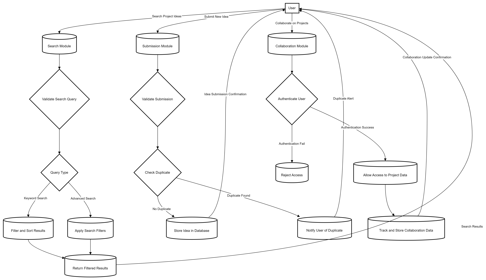

# Project Idea Hub

Welcome to the **Project Idea Hub** repository! This project is designed to inspire creativity and innovation by providing a wide range of project ideas across various fields.

## Table of Contents

- [Introduction](#introduction)
- [Goals](#goals)
- [Features and Functionality](#features-and-functionality)
- [Wireframes and Mockups](#wireframes-and-mockups)
- [Data Flow Diagram (DFD)](#data-flow-diagram-dfd)
- [Installation](#installation)
- [Usage](#usage)
- [Contributing](#contributing)
- [License](#license)
- [Contact](#contact)

## Introduction

**Project Idea Hub** is a platform created to serve as a comprehensive resource for individuals looking for creative and innovative project ideas. Whether you're a student, a professional, or simply a hobbyist, you'll find a wide array of project ideas that cater to different levels of expertise and interest areas. The platform is designed to not only provide inspiration but also to guide users through the process of bringing these ideas to life.

## Goals

The primary goals of **Project Idea Hub** are:

- **Inspiration**: To be a source of creative and innovative project ideas.
- **Guidance**: To provide detailed instructions and resources to help users implement the ideas.
- **Collaboration**: To create a community where users can share ideas and work together on projects.
- **Continuous Learning**: To encourage continuous learning and skill development through practical projects.

## Features and Functionality

**Project Idea Hub** offers the following key features:

- **Search and Filter**: Users can search for project ideas based on categories, difficulty level, and keywords.
- **Project Documentation**: Each project idea comes with detailed documentation, including step-by-step instructions, required tools, and resources.
- **User Submissions**: Users can submit their own project ideas and share them with the community.
- **Collaboration Tools**: Features like project discussion boards and idea-sharing forums encourage collaboration among users.
- **Regular Updates**: The platform is regularly updated with new project ideas and the latest trends.

## Wireframes and Mockups

Here are some initial wireframes and mockups that illustrate the design and layout of **Project Idea Hub**:

- **Home Page**: A simple and clean interface with search functionality, featured projects, and categories.
- **Project Detail Page**: A page that provides detailed information about a specific project idea, including images, instructions, and related projects.
- **User Dashboard**: A personalized dashboard where users can manage their submissions, saved ideas, and collaborations.


> _Note: Replace the placeholder paths with actual links to your wireframes and mockups._

## Data Flow Diagram (DFD)

The Data Flow Diagram (DFD) for **Project Idea Hub** helps visualize the flow of information within the system. It shows how data moves from the user input to the database and how the system processes and returns the output.

**Level 0 - Context Diagram:**

- **Users** interact with the system by searching for project ideas, submitting new ideas, and collaborating with others.
- **System** processes the requests, retrieves or stores data in the database, and presents the results back to the users.

**Level 1 - Detailed DFD:**

- **Search Module**: Handles user input for searching project ideas and filters results based on user preferences.
- **Submission Module**: Allows users to submit new project ideas, which are then stored in the database.
- **Collaboration Module**: Manages user interactions for discussion and collaboration on projects.




## Installation

To get started with **Project Idea Hub** locally, follow these steps:

1. **Clone the repository**:
    ```bash
    git clone https://github.com/yourusername/project-idea-hub.git
    ```

2. **Navigate to the project directory**:
    ```bash
    cd project-idea-hub
    ```

3. **Install the dependencies** (if applicable):
    ```bash
    npm install
    ```

4. **Start the development server**:
    ```bash
    npm start
    ```

5. **Open your browser** and visit `http://localhost:3000` to see the project in action.

## Usage

### How to Use Project Idea Hub

- Browse through the available project ideas.
- Follow the detailed instructions to start your own project.
- Share your own ideas by submitting them to the platform.
- Collaborate with others by joining the community.

### Project Structure

- **/src**: Contains the source code of the application.
- **/public**: Contains public assets like images and icons.
- **/docs**: Documentation files related to the project.

## Contributing

We welcome contributions from the community! If you'd like to contribute, please follow these steps:

1. **Fork the repository**.
2. **Create a new branch** for your feature or bug fix:
    ```bash
    git checkout -b feature/your-feature-name
    ```
3. **Make your changes**.
4. **Commit your changes** with a clear and concise message:
    ```bash
    git commit -m "Add feature: your feature name"
    ```
5. **Push your changes** to your forked repository:
    ```bash
    git push origin feature/your-feature-name
    ```
6. **Create a Pull Request** to the main repository.

Please ensure your code follows the project's coding standards and passes all tests before submitting.

## License

This project is licensed under the MIT License. See the [LICENSE](LICENSE) file for more details.

## Contact

If you have any questions, suggestions, or feedback, feel free to reach out:

- **Project Maintainer:** Sparsh Sharma
- **Email:** [your-email@example.com](mailto:your-email@example.com)

---

